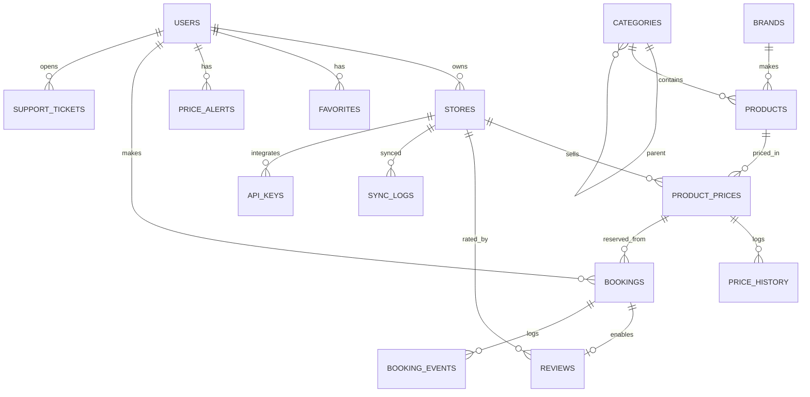

# Phase 02 — Database Schema (SRS §6 Blueprint)

**Goal:** every table from the SRS blueprint plus supporting tables, as Laravel
migrations with correct FKs, enums, and indexes, and Eloquent models with relationships.

**Prerequisites:** Phase 01. Postgres running.

## ERD



## Migrations (one file each, in this order)

### `users` (modify Laravel default)
| column | type | notes |
|---|---|---|
| role | enum: `user, vendor, admin` (default `user`) | guests are unauthenticated |
| phone | string nullable | |
| avatar_path | string nullable | |
| status | enum: `active, suspended, pending` (default `active`) | vendors start `pending` |
| warning_flag | boolean default false | SRS anti-fraud warning mark |
| restricted_until | timestampTz nullable | booking restriction |
| restriction_reason | string nullable | shown in profile per brief |
| two_factor_secret / two_factor_confirmed_at | text/timestamp nullable | TOTP (phase 04) |

### `categories`
`id, parent_id FK→categories nullable, name, slug unique, icon nullable, sort_order int, is_active bool`.
Multi-level tree per SRS. Index `(parent_id, sort_order)`.

### `brands`
`id, name, name_ar, slug unique, logo_path nullable`.

### `stores`
`id, user_id FK→users (vendor owner), name, slug unique, logo_path, website_url,
address, city, lat/lng decimal nullable, phone, email, is_verified bool default false,
rating_avg decimal(3,2) default 0, rating_count int default 0, timestamps`.
Index `slug`, `user_id`.

### `products`
`id, category_id FK, brand_id FK, name, name_ar, slug unique, description text,
specs jsonb` (grouped: screen/processor/camera/battery/memory…), `images jsonb`
(array of paths), `release_year smallint nullable, is_active bool, views_count bigint default 0,
compares_count bigint default 0, timestamps`.
Indexes: `slug`, `(category_id)`, `(brand_id)`, GIN on `specs`.

### `product_prices` — "the most important dynamic table" (SRS)
`id, product_id FK, store_id FK, price decimal(10,2), currency char(3) default 'SAR',
stock int default 0, affiliate_url string nullable, is_available bool default true,
source enum: api, import, scrape, manual (default manual), last_synced_at timestampTz nullable, timestamps`.
**Unique `(product_id, store_id)`.** Indexes: `(product_id, price)` for cheapest-first sort,
`(store_id)`, `last_synced_at`.

### `price_history`
`id, product_price_id FK, price decimal(10,2), recorded_at timestampTz`.
Index `(product_price_id, recorded_at)`. Written by a `ProductPrice` observer on
every price change (also on create) — single write path, used by the chart.

### `favorites`
`id, user_id FK, product_id FK, price_at_add decimal(10,2), timestamps`.
Unique `(user_id, product_id)`. `price_at_add` powers the "then vs now" arrow (brief §2.6).

### `price_alerts`
`id, user_id FK, product_id FK, threshold decimal(10,2), is_active bool default true,
triggered_at timestampTz nullable, timestamps`. Unique `(user_id, product_id)`.

### `bookings`
| column | type | notes |
|---|---|---|
| number | string unique | human code e.g. `BK-24-000173` |
| qr_token | uuid unique | for the QR code |
| user_id / store_id / product_id / product_price_id | FKs | |
| color / variant | string nullable | selected options |
| quantity | smallint (≤ config max 2) | |
| price_locked | decimal(10,2) | frozen at confirm |
| expected_arrival_at | timestampTz | **SRS: customer commits to a pickup time** |
| expires_at | timestampTz | confirm time + `platform.booking.hold_hours` (24h) |
| status | enum: `active, completed, cancelled, expired, no_show` | |
| reminder_sent_at | timestampTz nullable | dedupe pre-expiry reminder |
| completed_at / cancelled_at | timestampTz nullable | |
Indexes: `(user_id, status)`, `(store_id, status)`, `(status, expires_at)` for the expiry sweep.

### `booking_events` (fraud scoring, phase 12)
`id, booking_id FK, user_id FK, type enum: cancelled, no_show, completed, expired,
created_at`. Index `(user_id, type, created_at)` — rolling-window counts.

### `reviews` — **store reviews** (SRS §5: تقييم المتاجر مربوط بحجز مكتمل)
`id, booking_id FK unique, user_id FK, store_id FK, rating smallint 1–5,
body text nullable, status enum: pending, approved, rejected (default pending),
moderated_by FK→users nullable, moderated_at, timestamps`.
Unique `booking_id` = one review per completed booking.

### `support_tickets` + `ticket_messages` (phase 19)
tickets: `id, user_id FK, subject, category enum: bug, billing, store, other,
priority enum: low, normal, high, status enum: open, answered, closed,
assigned_to FK→users nullable, timestamps`.
messages: `id, ticket_id FK, user_id FK, body text, attachments jsonb nullable, created_at`.

### `ad_slots` + `ad_campaigns` (phase 18)
slots: `id, key unique (home_hero_side, search_top, product_sidebar), label, is_active`.
campaigns: `id, ad_slot_id FK, store_id FK nullable, title, image_path, target_url,
starts_at, ends_at, is_active, impressions bigint, clicks bigint, timestamps`.

### `product_stats` (vendor analytics — SRS: clicks & visits per product)
`id, product_id FK, store_id FK nullable, date date, views int, clicks int`.
Unique `(product_id, store_id, date)` — daily rollup, upserted by tracking endpoints.

### `sync_logs`
`id, store_id FK nullable, driver enum: api, scrape, import, task string,
status enum: success, failed, started, message text nullable, items_processed int,
started_at, finished_at`. Index `(status, started_at)` — admin health board.

### `security_events`
`id, user_id FK nullable, ip, type enum: login_failed, rate_limited, suspicious,
2fa_failed, meta jsonb, created_at`. Index `(type, created_at)`.

### `api_keys`
`id, store_id FK, name, key_hash, last_used_at, revoked_at nullable, timestamps`.

## Models
Create all Eloquent models with `$casts` (jsonb → array, enums → PHP backed enums in
`app/Enums/`), relationships mirroring the ERD, and:
- `Product::scopeActive()`, `Product::bestPrice()` helper (min available price).
- `ProductPriceObserver` → writes `price_history` + dispatches `PriceChanged` event
  (consumed by alerts in phase 10 and sync logging in phase 17).
- `Booking::isExpired()`, `Booking::remainingSeconds()`.

## Definition of Done
- [ ] `php artisan migrate:fresh` runs clean; `php artisan migrate:rollback` too.
- [ ] Enum classes exist in `app/Enums` (Role, BookingStatus, ReviewStatus, PriceSource, …).
- [ ] Tinker smoke test: create product + 2 store prices → `price_history` has 2 rows
      via the observer; update one price → 3rd row appears.
- [ ] Unique constraints verified (duplicate product×store price insert fails).

## Verification
```bash
cd backend && php artisan migrate:fresh && php artisan tinker
# >>> $p = Product::factory()->create(); … see DoD checks
```
